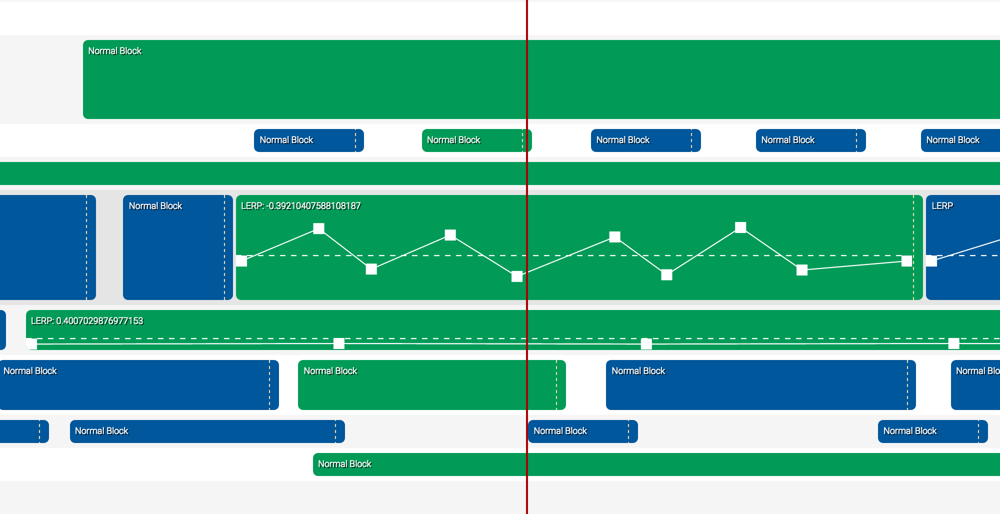

# timeflies.js

**JavaScript Timeline/sequencer UI Widget**

Suggested use cases include:
  * Sequencing sound
  * Video editing timelines
  * Cutscene composing for games/real-time stuff
  
**Features**
  * Lightweight: weighs in at less than 12kb minified
  * No dependencies. Just drop it into your project, and you're good to go
  * Easy to skin (look at [./less/light.less](less/light.less) to see how)
  * Supports composite blocks, meaning you can add your own block types easily, with (optionally) their own UI inside the block (e.g. a spline editor block)    
  * Supports drag 'n dropping blocks onto lanes
  * Zooming
  * Blocks are freeform, and can be moved across lanes (by holding shift and dragging), moved (by dragging), and resized (by grabbing the resize handle on the far-right)  
  * Lanes can be vertically resized interactively, to make room for e.g. a spline editor inside a block
  * Liberally licensed    
      
#Building
 
To build timeflies.js, you need [bakor](https://github.com/iqumulus/bakor/) installed. Bakor is a node module, 
and must be installed globally, i.e. `npm install -g bakor`.
Once installed, build by running `bakor` in the timeflies.js root directory.

This will produce a set of files in the `./build/` directory which can be included in your application.
 
#Examples

Examples can be found in the [examples](/examples) folder. There's a simple express server in the repository ([/bin/www](/bin/www)).
To use this, first run `npm install` in the root directory (or `sudo npm install` on OSX), then run `node bin/www`.
This will start an HTTP server serving up the examples-folder on port `3050`. Note that you **have to** run this server for the examples to work
properly, as they use the "unbuilt" sources - both for the JavaSript, and for the CSS. 
 
After starting the server as descripted above, go to [http://127.0.0.1:3050/helloworld.html](http://127.0.0.1:3050/helloworld.html) in your browser for a full listing of examples.
 
#Usage

**Creating a timeline control**
    
    var timeline = tf.Sequencer(document.body);

The first argument is the DOM node to attach to.
    
**A note on events**

Most things emit events which can be listened to using the `on(event, callback)` function.
This function returns a function that can be called to unsubscribe from the event.
Details on which events are available can be found below.
    

**Adding custom blocks**
    
    tf.RegisterBlockType('MyCustomBlock', {
      state: {
        //Put initial state here.
        //The block copy of the state can be accessed using the this keyword.
      },
      construct: function (blockNode) {
        //Called when the block is created.
        //blockNode contains the block DOM node,
        //so this function can be used to e.g. add a spline editor in a block
      },
      destroy: function () {
        //Called when the block is destroyed
      },
      startProcess: function () {
        //Called when the block becomes active
      },
      stopProcess: function () {
        //Called when the block goes inactive after being active
      },
      process: function (blockTime) {
        //This is called when the block is active.
        //blockTime contains the time relative to the block progression
        //in range [0..1]    
      }
    });
    
**tf.Sequencer Interface**
  * `lane(number)`: returns a lane based on index, or false if out of bounds.   
  * `on(event, callback)`: attach an event listener to the timeline.
  * `forEachLane(callback)`: iterate through lanes 
  * `resize()`: resizes the timeline control to fit its parent
  * `setTime(timeMS)`: set the current time in milliseconds
  * `process()`: process the timeline, activates any blocks intersecting with the current time
  * `zoom(factor)`: set zoom factor. Factor is number of milliseconds per. pixel e.g. 1 means 1 pixel = 1 milliseconds, and 1000 means 1 pixel = 1 second
  * `toJSON()`: serialize the timeline to a JSON object
  * `fromJSON(obj)`: unserialize the timeline from a JSON object
  * `play()`: start playing back the sequence from current time
  * `pause()`: pause playback
  * `isPlaying()`: returns the current playback state
  * `time()`: returns the current time in milliseconds
  * `zoomFactor()`: returns the current zoom factor
  * `gotoStart()`: goto the start of the sequence
  * `gotoEnd()`: goto the end of the sequence
    
*Events*
  * `Addlane : lane`: emitted when a lane is added    
  * `Play : time`: emitted when starting to play the sequence
  * `Pause : time`: emitted when stopping playback
  * `SetTime : time`: emitted when the time is **manually** set by moving the time marker
  * `Zoom : factor`: emitted when the sequencer's zoom factor changes
    
**Lane Interface**
  * `removeBlock(id)`: remove a block from the lane
  * `destroy()`: destroy the lane - removes it from the timeline control
  * `addBlockAtPixel(pixel, attributes)`: add a block on a given pixel (x-coordinate). Attributes is an object containing the block initializer (see below).
  * `addBlockAtTime(timems, attributes`: add a block on a given time
  * `body`: the body DOM node for the lane
  * `on(event, callback)`: attach an event listener to the lane
  * `scrollTo(pos)`: scroll to a given pixel 
  * `process(timeMs)`: process the lane with the time supplied
  * `zoomUpdate`: updates the positions of all the child blocks to fit the current zoom factor
  * `toJSON()`: serializes the lane to a JSON object
  * `fromJSON(obj)`: unpack the lane from an object

*Events*
  * `AddBlock : <block instance>`: emitted when a new block is added to the lane
  * `RemoveBlock : <block>`: emitted when a block is removed from the lane
  * `Destroy`: emitted when the lane is destroyed

**Adding Blocks**

Blocks can be added either by dragging them onto a lane, or by programatically calling `addBlockAtPixel` or `addBlockAtTime` on a lane.
To make a draggable `div` that creates a block on a lane when dropped, use `tf.Draggable`:
  
    tf.Draggable(MyDiv, 'block', {
      //Initialization arguments
    });
  
The initialization object is the same as that which can be supplied to the `addBlockAt` functions.
It can have the following options (all are optional, though type should normally be supplied):

    {
      type: <type of node, corresponds with the first argument for tf.RegisterBlockType calls>,
      start: <start time in milliseconds>,
      length: <length of block in milliseconds>,
      state: <the local state, this is accessed using this in the functions supplied to tf.RegisterBlockType>
    }        
    
# License

MIT. See LICENSE.md for details.
