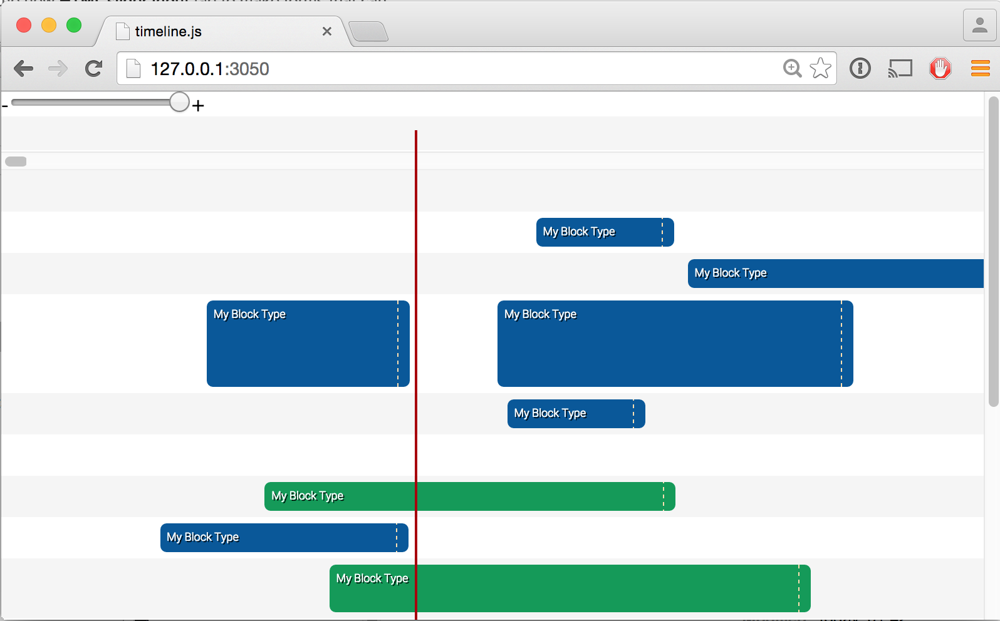

# timeline.js

**Timeline UI Widget**

Suggested use cases include:
  * Sequencing sound
  * Video editing timelines
  * Cutscene composing for games/real-time stuff
  
**Features**
  * Lightweight: weighs in at less than 10kb minified
  * No dependencies. Just drop it into your project, and you're good to go
  * Easy to skin (look at `./less/light.less` to see how)
  * Supports composite blocks, meaning you can add your own block types easily (e.g. a spline editor block)    
  * Supports drag 'n dropping blocks onto lanes
  * Zooming
  * Blocks are freeform, and can be moved across lanes (by holding shift and dragging), moved (by dragging), and resized (by grabbing the resize handle on the far-right)  
  * Lanes can be vertically resized interactively, to make room for e.g. a spline editor inside a block
      
#Building
 
 To build timeline.js, you need bakor installed. Bakor is a node module, 
 and must be installed globally, i.e. `npm install -g bakor`.
 Once installed, build by running `bakor` in the timeline.js root directory.
 
 This will produce a set of files in `./build/` which can be included in your application.
 
#Usage

**Creating a timeline control**
    
    var timeline = tl.Timeline(document.body);
    
The first argument is the DOM node to attach to.

**Adding custom blocks**
    
    tl.RegisterBlockType('MyCustomBlock', {
      state: {
        //Put initial state here.
        //The block copy of the state can be accessed using the this keyword.
      },
      construct: function (blockNode) {
        //Called when the block is created.
        //blockNode contains the block DOM node,
        //so this function can be used to e.g. add a spline editor in a block
      },
      startProcess: function () {
        //Called when the block becomes active
      },
      stopProcess: function () {
        //Called when the block goes inactive after being active
      },
      process: function (blockTime) {
        //This is called when the block is active.
        //blockTime contains the time relative to the block progression
        //in range [0..1]    
      }
    });
    
**Timeline Interface**
  * `timeline.lane(number)`: returns a lane based on index, or false if out of bounds.   
  * `timeline.on(event, callback)`: attach an event listener to the timeline.
  * `forEachLane(callback)`: iterate through lanes 
  * `resize()`: resizes the timeline control to fit its parent
  * `setTime(timeMS)`: set the current time in milliseconds
  * `process()`: process the timeline, activates any blocks intersecting with the current time
  * `zoom(factor)`: set zoom factor. Factor is number of milliseconds per. pixel
    
**Lane Interface**
  * `removeBlock(id)`: remove a block from the lane
  * `destroy()`: destroy the lane - removes it from the timeline control
  * `addBlockAtPixel(pixel, attributes)`: add a block on a given pixel (x-coordinate). Attributes is an object containing the block initializer (see below).
  * `addBlockAtTime(timems, attributes`: add a block on a given time
  * `body`: the body DOM node for the lane
  * `on(event, callback)`: attach an event listener to the lane
  * `scrollTo(pos)`: scroll to a given pixel e.g. 1 means 1 pixel = 1 milliseconds, and 1000 means 1 pixel = 1 second
  * `process(timeMs)`: process the lane with the time supplied
  * `zoomUpdate`: updates the positions of all the child blocks to fit the current zoom factor

**Adding Blocks**
Blocks can be added either by dragging them onto a lane, or by programatically calling `addBlockAtPixel` or `addBlockAtTime` on a lane.
To make a draggable `div` that creates a block on a lane when dropped, use `tl.Draggable`:
  
    tl.Draggable(MyDiv, 'block', {
      //Initialization arguments
    });
  
The initialization object is the same as that which can be supplied to the `addBlockAt` functions.
It can have the following options (all are optional, though type should normally be supplied):

    {
      type: <type of node, corresponds with the first argument for tl.RegisterBlockType calls>,
      start: <start time in milliseconds>,
      length: <length of block in milliseconds>,
      state: <the local state, this is accessed using this in the functions supplied to tl.RegisterBlockType>
    }        
    
# License

MIT. See LICENSE.md for details.
